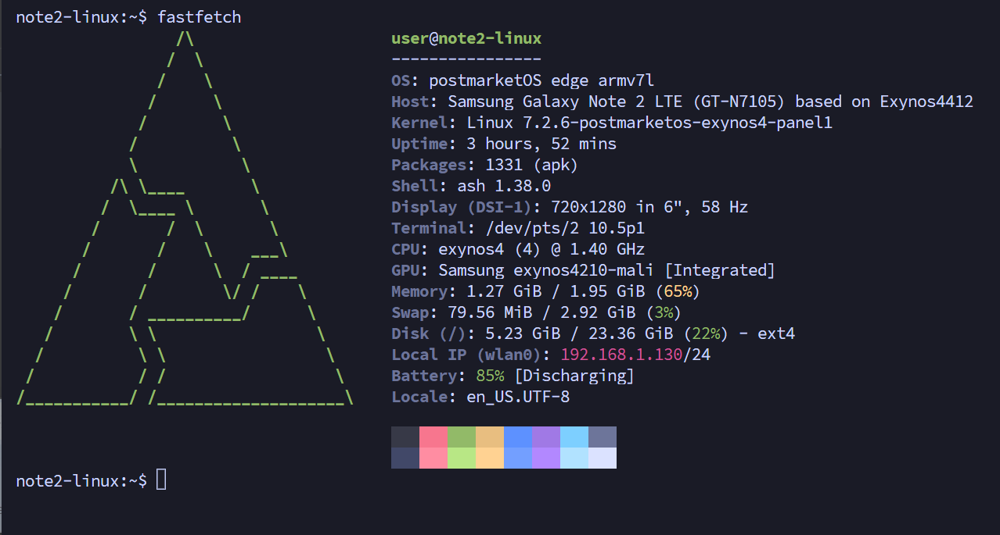
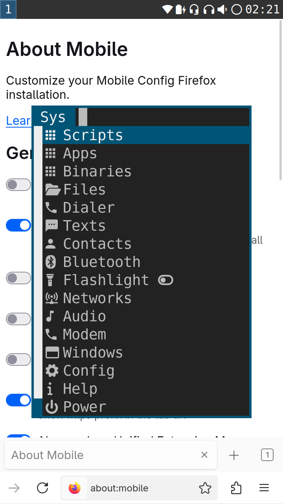
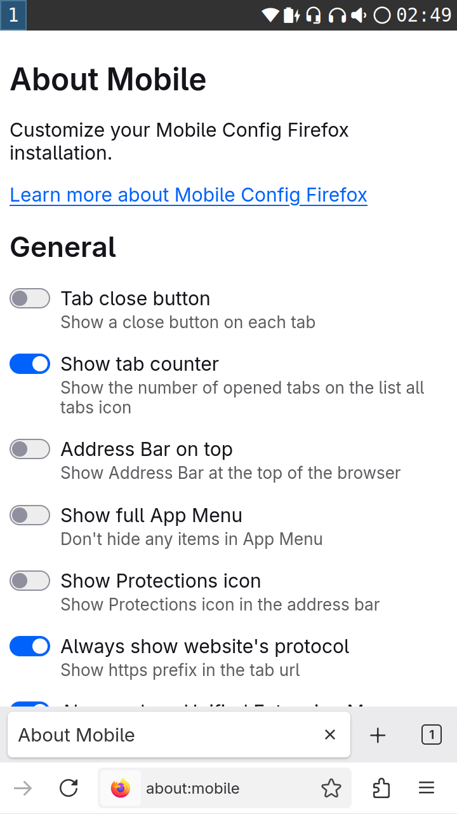

# postmarketOS for KT Galaxy Note II (SHV-E250K)

[English](README.md) · [한국어](README.ko.md)

An **experimental Linux/postmarketOS port** for the Korean KT Galaxy Note II, focused on Wi-Fi SSH with a usable Sxmo desktop, touchscreen, S Pen and hardware keys.

*Actual fastfetch output from the tested phone, provided by its owner. The GT-N7105 host label comes from the shared device tree; the physical device is a KT SHV-E250K.*

**Tested hardware: one SHV-E250K with a Samsung S6EVR02 panel.** GT-N7100/N7105, SHV-E250S/L and EA8061 panels have not been validated with this release. A custom recovery's displayed model name is not reliable evidence of the actual variant.

[Downloads](https://github.com/sioaeko/postmarketos-shv-e250k/releases) · [Build](docs/BUILD.md) · [Apply and recover](docs/INSTALL.md) · [Usage](docs/USAGE.md) · [Changelog](CHANGELOG.md)

## On-device screenshots

Actual 720×1280 compositor captures from the same phone running Sxmo/Sway.

| Sxmo system menu | Firefox ESR with mobile-config-firefox |
| --- | --- |
|  |  |

## What this release provides

- The on-device kernel APK: `7.2.6-postmarketos-exynos4-panel1`, with its public verification key
- Complete corresponding Linux source, patches, exact kernel config, and build/package tools
- Late display initialization and Sxmo settings for touch, S Pen, hardware keys, key LEDs and display idle
- Chromium launch flags and instructions for Firefox's mobile interface
- A BOOT image packer using the recipient's filesystem UUIDs, plus an initramfs module consistency checker

**This is a developer release, not a turnkey ROM.** It includes no TWRP installer ZIP, generic BOOT image or rootfs image. The working installation contains personal data and device-specific settings, so it has not been cloned for distribution. A full installation from Android on a second device remains untested.

## Hardware and software status

| Feature | Observed status |
| --- | --- |
| Wi-Fi / SSH | Working on the tested installation; automatic suspend is disabled to preserve SSH access |
| Sxmo / Sway | Usable on the 720×1280 panel at scale 2 |
| Panel colors and wake brightness | Cached gamma restored before DISPLAY_ON by the kernel patch |
| Touchscreen / S Pen | Simultaneous input confirmed; device-specific pen calibration included |
| Menu, Home and Back keys / key LEDs | Sxmo bindings working; illumination follows display state |
| Display idle | Screen off after 10 minutes by default; one power action restores display and input |
| Firefox ESR | Mobile interface checked with `mobile-config-firefox` |
| Chromium | Launch checked with GPU rendering disabled; sandbox retained |
| Cellular calls/data, camera, Bluetooth, audio | Not validated in this porting work |
| Accelerated video, complete suspend/resume | Not validated; automatic suspend is disabled |

The current boot workaround loads the display driver **after 60 seconds of uptime**. Expect a delay before the graphical session appears. This is not a claim of stability across all power cycles, long-running workloads or other units. See the [validation notes](docs/VALIDATION.md) for the evidence and remaining limitations.

## Upstream projects

Built on Linux 7.2.6, [Exynos4 mainline](https://gitlab.com/exynos4-mainline/linux), postmarketOS's archived `device-samsung-t0lte` package, and [Sxmo](https://sxmo.org/). Original contributors and licenses are documented in [Provenance](docs/PROVENANCE.md). This repository is an independent experiment, not an official postmarketOS release or a change to upstream device support status.
